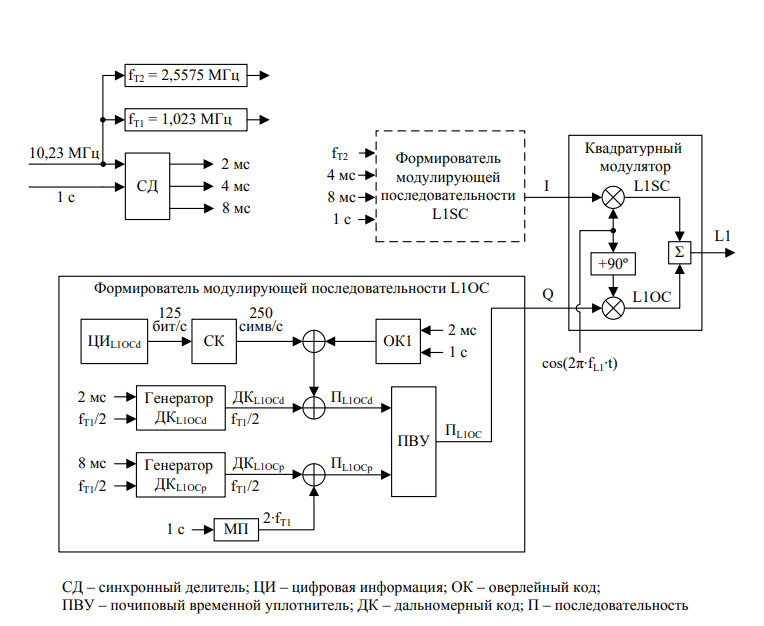
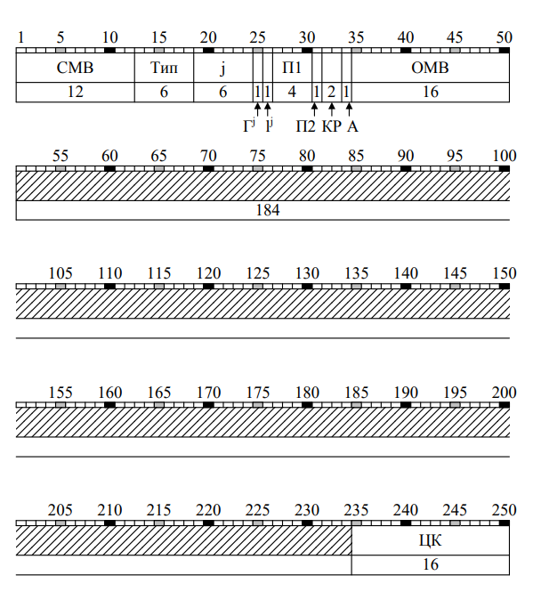
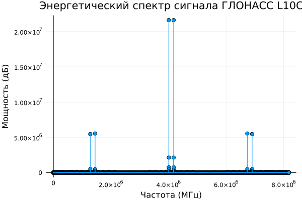
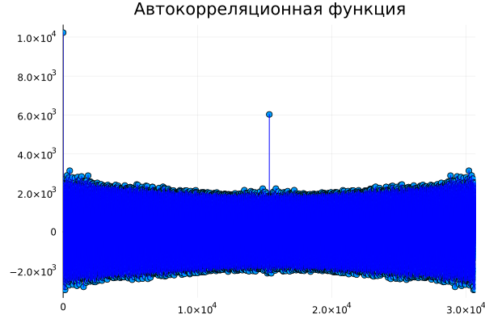

## Моделирование сигнала L1OC ##

Формирование сигнала L1OC происходит следующим образом:

Формируем нашу цифровую информацию (далее ЦИ), которая передается 2с. времени.

ЦИ состоит из 250 бит:

* На СМВ приходится 12 бит и это константа, равная 010111110001.

* Тип, на который приходится 6 бит - наше сообщение, передаваемое НКА (101010...). Соответственно Тип строки = 42 (переводя в десятичное представление).

* J - номер НКА, передающего сообщение, на который приходится 6 бит. По условию задачи - 14. Переводя в двоичную систему - 001110.

* В остальные ячейки записываем наше сообщение (10101010...), за исключением поля ОМВ, на который приходится 16 бит. Данное поле передает информацию о начале времени передающего сообщения. По нашему условию оно синхронизированно с началом суток, т.е. 0000000000000000.

* На ЦК приходится 16 бит - циклический код, на основе данных ЦИ от 1 до 234 битов. Описание ЦК см. generate_circular_code! в файле generators.jl 

После чего наша ЦИ проходит сверточное кодирование (см. convolutional_encoder файла generators.jl).

Далее идет процесс синхронизации нашей информации с оверлейным кодом(последовательность 01).

Параллельно с этими 2с. времени передачи ЦИ генерируются дальномерные коды для data- и pilot- компонент с одинаковой чистотой. За время передачи ЦИ у нас сгенерировалось ДК_L1OCd длиной 1023000 и ДК_L1OCp длиной 4092000.

Вместе с ДК_L1OCd происходит синхронизация с ЦИ после процесса синхронизации СК с ОК1. И на выходе получаем последовательность П_L1OCd, длина которой равна длине ДК_L1OCd.

Вместе с ДК_L1OCp происходит синхронизация с меандровой последовательностью(последовательность 0101). После которой длина последовательности П_L1OCp стала в 4 раза больше ДК_L1OCp (за счет синхронизации с МП).

В ПВУ у нас происходит модуляция над каждой последовательность компонент сигнала. Для П_L1OCd - BPSK(1) (см. bpsk_modulator файла modulators.jl), а для П_L1OCp - ВОС(1, 1) (см. boc_1_1_modulator файла modulators.jl). После этого они объединяются с помощью почипового временного уплотнителя (см. chip_time_compaction файла modulators.jl), получая последовательность П_L1OC.

После прохождения QPSK(Квадратурный модулятор. см. qpsk_modulator файла modulators.jl) мы получаем наш сигнал L1OC с кодовым разделением в диапазоне L1.

Поскольку по условию задачи нам необходимо смоделировать сигнал на выборки 20мс, мы рассматриваем сигнал L1OC длиной от 1 до 30690.

На основе этого моделируем энергетический спектр с помощью преобразования Фурье и автокорреляционную функцию с помощью т.Винера-Хинчина и визуализируем полученные данные на графиках, получая на выходе:

